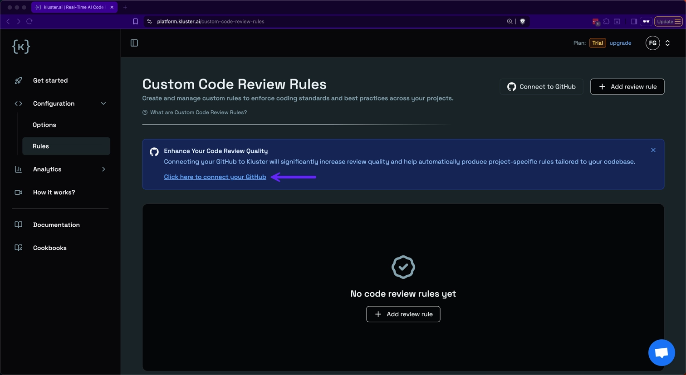
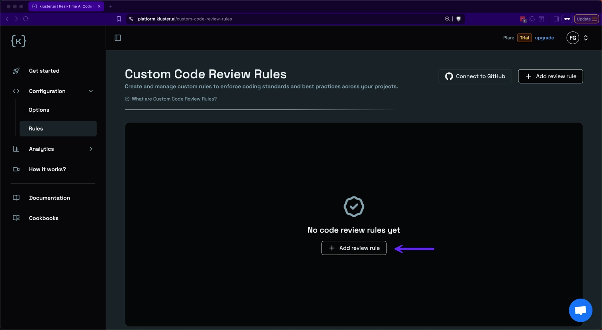
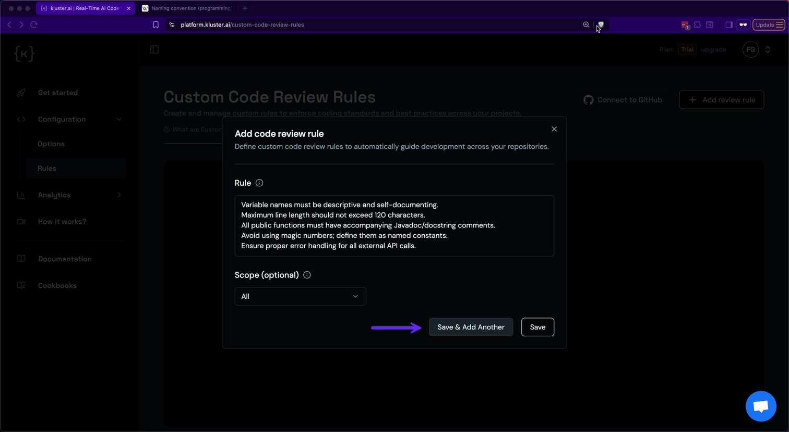

# Custom rules

Rules define practices, guidelines, and patterns that maintain code quality for your projects. When connected to GitHub, each repository becomes a project with its own learned rules. You can also create manual rules that apply globally or to specific projects. [kluster.ai](https://kluster.ai){target=_blank} Verify code automatically checks newly generated code against these rules.

## Rule Types

- **Manual rules**: Custom rules you create based on your team's specific requirements and coding standards.
- **Learned rules**: Automatically extracted from your GitHub repositories, continuously updated to reflect your codebase patterns.

## Set up instructions

You can create manual rules to enforce your team's coding standards or connect GitHub to automatically extract patterns from your repositories. Rules can be applied globally or to specific projects.

!!! info "Extraction rate limit"
    Rule extraction from repositories is limited to once per hour. Wait 60 minutes between extraction requests.

1. **Access the platform**: Navigate to [Custom Code Review Rules](https://platform.kluster.ai/custom-code-review-rules){target=_blank}.

2. **Connect GitHub** (Optional): Connect your GitHub account to enable project-specific rules. In this context, each GitHub repository is treated as a 'project' - Verify code learns patterns from each repository and applies those specific rules when reviewing code for that project.

    

3. Click **Add review rule** to create custom rules.

    

4. **Configure rule scope**: Enter your rule and select the scope:
    - **All**: Rules apply globally to all your coding sessions.
    - **Project-specific**: Select a repository from the dropdown (requires GitHub connection).

5. Click **Save & Add Another** to add multiple rules or **Save** to finish.

    

## Next steps

- [View all integrations](/verify/integrations/): Set up Verify code in your preferred IDE.
- **[See real examples](/verify/examples/cursor-firebase-nextjs/)**: Walk through a complete Firebase migration case study.